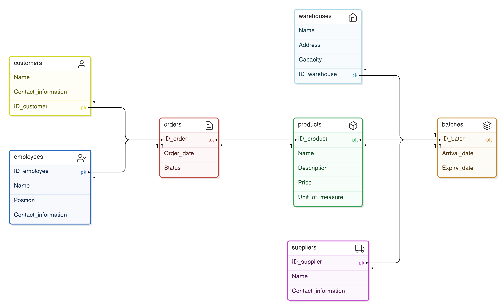

# Практическая 1
## Добрин В.П.
## ЭФМО-01-24

___

___
### Сущности:

Склад:

Атрибуты: ID_склада, Название, Адрес, Емкость
Продукт:

Атрибуты: ID_продукта, Название, Описание, Цена, Единица_измерения
Партия:

Атрибуты: ID_партии, Дата_поступления, Срок_годности
Поставщик:

Атрибуты: ID_поставщика, Название, Контактная_информация
Заказчик:

Атрибуты: ID_заказчика, Название, Контактная_информация
Заказ:

Атрибуты: ID_заказа, Дата_заказа, Статус
Сотрудник:

Атрибуты: ID_сотрудника, Имя, Должность, Контактная_информация
### Связи:

Склад и Продукт:

Связь: "Хранит"
Тип: Многие ко многим (один склад может хранить много продуктов, один продукт может храниться на многих складах)
Продукт и Партия:

Связь: "Содержит"
Тип: Один ко многим (один продукт может содержать много партий, но партия относится к одному продукту)
Партия и Поставщик:

Связь: "Поставляется"
Тип: Многие к одному (много партий могут быть от одного поставщика, но партия имеет одного поставщика)
Заказ и Продукт:

Связь: "Содержит"
Тип: Многие ко многим (один заказ может содержать много продуктов, один продукт может быть в многих заказах)
Заказ и Заказчик:

Связь: "Сделан"
Тип: Многие к одному (много заказов могут быть сделаны одним заказчиком, но заказ имеет одного заказчика)
Склад и Сотрудник:

Связь: "Управляется"
Тип: Один ко многим (один склад может управляться многими сотрудниками, но сотрудник работает на одном складе)
