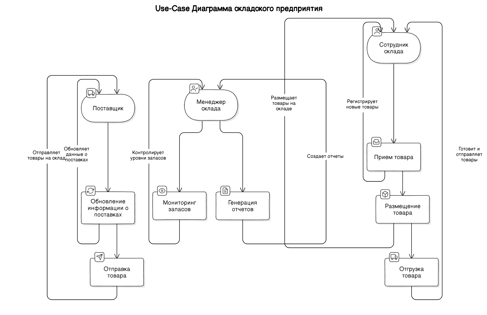

# Практическая 2
## Добрин В.П.
## ЭФМО-01-24

___

___

# Система управления складом

## Описание

Данная система управления складом предназначена для оптимизации операций по приему, хранению и отгрузке товаров. В системе участвуют три основных актора: Менеджер склада, Сотрудник склада и Поставщик.

## Акторы и их роли

### 1. Менеджер склада

- **Роль**: Управление складскими операциями.
- **Варианты использования**:
  - **Мониторинг запасов**: Просмотр текущих запасов и получение уведомлений о низком уровне запасов.
  - **Генерация отчетов**: Создание отчетов о движении товаров и эффективности операций.

### 2. Сотрудник склада

- **Роль**: Операции по приему, размещению и отгрузке товаров.
- **Варианты использования**:
  - **Прием товара**: Регистрация поступления новых товаров.
  - **Размещение товара**: Размещение товаров на стеллажах.
  - **Отгрузка товара**: Подготовка и отгрузка товаров по заказам.

### 3. Поставщик

- **Роль**: Поставка товаров на склад.
- **Варианты использования**:
  - **Обновление информации о поставках**: Обновление данных о текущих и предстоящих поставках.
  - **Отправка товара**: Инициирование отправки товаров на склад.