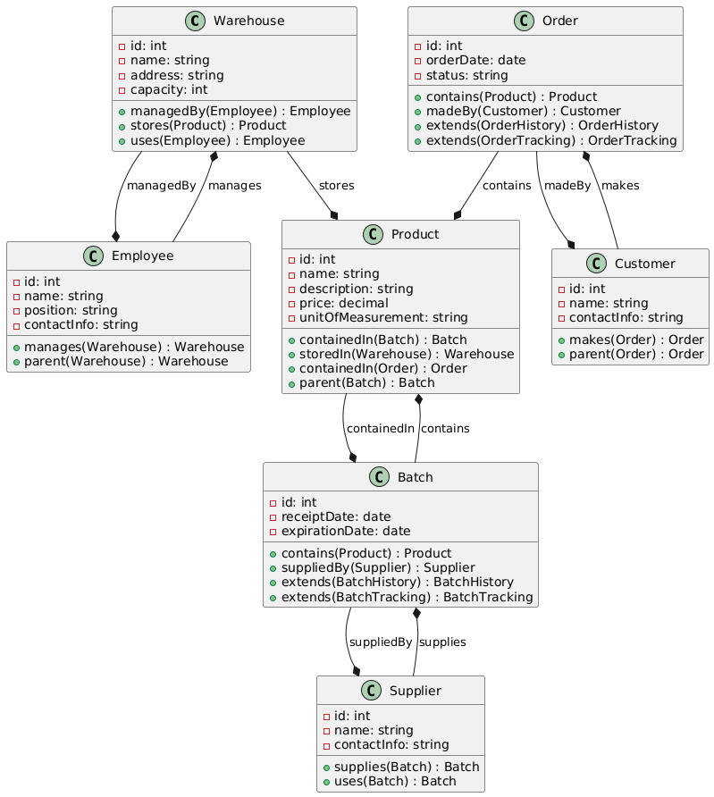

# Практическая 3
## Добрин В.П.
## ЭФМО-01-24

___

___

**Обзор классов**
=====================

Система состоит из 6 классов: Warehouse, Product, Batch, Supplier, Customer и Employee.

### 1. Warehouse
#### Описание
Класс представляет физическое хранилище для продуктов.
#### Атрибуты
* `id`: уникальный идентификатор склада
* `name`: имя склада
* `address`: физический адрес склада
* `capacity`: максимальная емкость хранения склада
#### Отношения
Класс имеет отношения с классами Employee, Product и самим собой.

### 2. Product
#### Описание
Класс представляет собой товар, хранящийся на складе.
#### Атрибуты
* `id`: уникальный идентификатор продукта
* `name`: имя продукта
* `description`: краткое описание продукта
* `price`: цена продукта
* `unitOfMeasurement`: единица измерения для продукта
#### Отношения
Класс имеет отношения с классами Batch